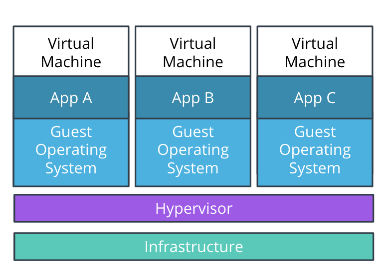

# Docker For Application Packaging

## Why Container and Container Orchestration?

Once a team has developed an application, the next phase is to move on to the release process. This includes techniques for:
 - service packaging 
 - containerization
 - distribution

The end result of a product release is represented by a service that is deployed in a production environment and can be accessed by consumers.

## Transitions from VMs to Containers

### VMs
In the past years, VMs (Virtual Machines) were the main mechanism to host an application. VMs encapsulate the code, configuration files, and dependencies necessary to execute the application.



In essence, a VM is composed of an operating system (OS) with a set of pre-installed libraries and packages. During execution, an application utilizes an OS filesystem, resources, and packages.

A set of VMs is managed through hypervisor. A hypervisor provides the virtualization of the infrastructure which is composed of physical servers. As a result, a hypervisor is capable of creating, configuring, and managing multiple VMs on the available servers. For example, we are able to running applications A, B, and C on 3 separate VMs.

The utilization of VMs introduced standardization in infrastructure provisioning, in association with efficient use of available infrastructure. Instead of running an application per server, a hypervisor enables multiple VMs to run at the same time to host multiple applications. However, there is one downside to this mechanism: it is not efficient enough. For example, applications A, B, and C uses the same Operating System. Replicating an OS consumes a lot of resources, and the more applications we run the more space we allocate to the replication of the operating systems alone.

### Containers


There was a clear need to optimize the usage of the available infrastructure. As a result, the virtualization of the Operating System was introduced. This prompted the appearance of containers, which represent the bare minimum an application requires for a successful execution e.g., code, config files, and dependencies. By default, there is a better usage of available infrastructure.

Multiple VMs on a hypervisor are replaced by multiple containers running on a single host operating system. The processes in the containers are completely isolated but are able to access the OS filesystem, resources, and packages. The creation and execution of containers is delegated to a container management tool, such as Docker.

The appearance of containers is unlocked by OS-level virtualization and as a result, multiple applications can run on the same OS. By nature, containers are lightweight, as these encapsulate only the application code and essential dependencies. Consequently, there is a better usage of available infrastructure and a more efficient pathway to release a product to consumers.

## Introducing Docker for Application Packaging

The appearance of containers enabled organizations to ship products using a lightweight mechanism, that would make the most of available infrastructure. There are plenty of tools used to containerize services, however, Docker has set the industry standards for many years.

To containerize an application using Docker, 3 main components are distinguished:
-	Dockerfiles
-	Docker images
-	Docker registries

### Dockerfile

A Dockerfile is a set of instructions used to create a Docker image. Each instruction is an operation used to package the application, such as installing dependencies, compile the code, or impersonate a specific user.

A Docker image is composed of multiple layers, and each layer is represented by an instruction in the Dockerfile. All layers are cached and if an instruction is modified, then during the build process only the changed layer will be rebuilt. As a result, building a Docker image using a Dockerfile is a lightweight and quick process.

To construct a Dockerfile, it is necessary to use the pre-defined instructions, such as:

<font color=#0000FF>**FROM**</font> - to set the base image<br>
<font color=#0000FF>**RUN**</font> – to execute a command<br>
<font color=#0000FF>**COPY & ADD** </font> – to copy files from host to the container<br>
<font color=#0000FF>**CMD** </font> – to set the default command to execute when the container starts<br>
<font color=#0000FF>**EXPOSE** </font> – to expose an application port<br>

Below is an example of a Dockerfile that targets to package a Python hello-world application:

```python
# Set the base image. Since we are running a
# Python application a Python base image is used
FROM python:3.8

# Set a key-value label for the Docker image
LABEL maintainer="Jonathan Yeh"

# Copy files from the host to the container filesystem.
# For example, all the files in the current directory
# to the "/app" directory in the container
COPY . /app

# Defines the working directory within the container.
# In this case is "/app"
WORKDIR /app

# Run commands within the container.
# For example, invoke a pip command
# to install dependencies defined in the requirements.txt file
RUN pip install -r requirements.txt

# Provide a command to run on container starts.
# For example, start the "app.py" application
CMD ["python3", "app.py"]
```

### Docker Image

Once a Dockerfile is constructed, these instructions are used to build a Docker image. A Docker image is a read-only template that enables the creation of a runnable instance of an application. In a nutshell, a Docker image provides the execution environment for an application, including any essential code, config files, and dependencies.

A Docker image can be built from an existing Dockerfile using the `docker build` command. Below is the syntax for this command:

```python
# Build an image

# OPTIONS – optional; define extra configuration

# PATH – required; sets the location of the Dockerfile and any referenced files
docker build [OPTIONS] PATH

# Where OPTIONS can be:
-t, --tag	set the name and tag of the image
-f, --file	set the name of the Dockerfile
--build-arg	set build-time variables

# Find all valid options for this command
docker build --help
```

For example, to build the image of the Python hello-world application from the Dockerfile, the following command can be used:

```python
# Build an image using the Dockerfile from the current directory
docker build -t python-helloworld .

# Build an image using the Dockerfile from the `lesson1/python-app` directory
docker build -t python-helloworld lesson1/python-app
```

Before distributing the Docker image to a wider audience, it is paramount to test it locally and verify if it meets the expected behavior. To create a container using an available Docker image, the `docker run` command is available. Below is the syntax for this command:

```python
# Execute an image

# OPTIONS  optional; define extra configuration

# IMAGE  required; provides the name of the image to be executed

# COMMAND and ARGS optional; instruct the container to run specific commands when it starts
docker run [OPTIONS] IMAGE [COMMAND] [ARG…]

# Where OPTIONS can be:
-d, --detach   run in the background
-p, --publish  expose container port to host
-it, 	       start an interactive shell

# Find all valid options for this command
docker run --help
```

For example, to run the Python help-world application, using the created image, the following command can be used:

**Note:** To access the application in browser, we need to bind the Docker container port to a port on the host or local machine. In this case, `5111` is the host port that we use to access the application e.g., `http://127.0.0.1:5111/`. The `5000` is the container port that the application is listening to for incoming requests.

```python
# Run the `python-helloworld` image, in detached mode and expose it on port `5111`
docker run -d -p 5111:5000 python-helloworld
```

To retrieve the Docker container logs, we can use the `docker logs {{ CONTAINER_ID }}` command. For example:

```python
docker logs 95173091eb5e

## Example output from a Flask application
* Serving Flask app "app" (lazy loading)
* Environment: production
WARNING: This is a development server. Do not use it in a production deployment.
Use a production WSGI server instead.
* Debug mode: off
```

### Docker Registry

The last step in packaging an application using Docker is to store and distribute it. So far, we have built and tested an image on the local machine, which does not ensure that other engineers have access to it. As a result, the image needs to be pushed to a **public Docker image registry**, such as Dockerhub, Harbor, Google Container Registry, and many more. However, there might be cases where an image should be private and only available to trusted parties. As a result, a team can host private image registries, which provides full control over who can access and execute the image.

Before pushing an image to a Docker registry, it is highly recommended to tag it first. During the build stage, if a tag is not provided (via the `-t` or `--tag` flag), then the image would be allocated an ID, which does not have a human-readable format (e.g. 0e5574283393). On the other side, a defined tag is easily scalable by the human eye, as it is composed of a registry repository, image name, and version. Also a tag provides version control over application releases, as new tag would indicate a new release.

To tag an existing image on the local machine, the `docker tag` command is available. Below is the syntax for this command:

```python
# Tag an image
# SOURCE_IMAGE [:TAG]  required and the tag is optional; define the name of an image on the current machine
# TARGET_IMAGE [:TAG]  required and the tag is optional; define the repository, name, and version of an image

docker tag SOURCE_IMAGE[:TAG] TARGET_IMAGE[:TAG]
```
